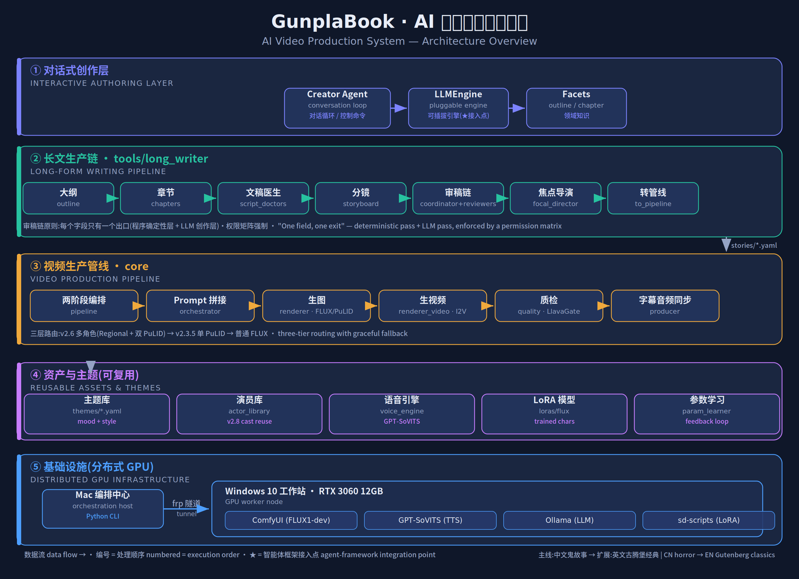

# GunplaBook — AI Video Production System

> An end-to-end, multi-agent pipeline that turns a one-line story concept into a
> fully narrated, subtitled short-form video — script, storyboard, character art,
> voice, and final cut — with human-in-the-loop control at every stage.

## 🎬 Showreel

<!-- OPTION A (simplest): drag-drop showreel.mp4 into this README in the GitHub
     web editor — it auto-uploads and embeds an inline player. Paste it here. -->

<!-- OPTION B: link a thumbnail to an unlisted video. Replace the URL + image. -->

*Selected outputs — each one auto-generated from a single concept line: script,
character art, voice-over, and final edit.*

---

## Architecture

<p align="center">
  
</p>

---

## What it does

GunplaBook takes a creative brief (e.g. *"a Qing-dynasty scholar trapped in a haunted
inn"*) and drives it through two cooperating pipelines:

1. **Long-form writing pipeline** — outline → chapters → script-doctor passes →
   storyboard → multi-reviewer refinement → shot direction.
2. **Video production pipeline** — prompt assembly → image generation
   (FLUX + identity-locked characters) → image-to-video → automated QA →
   subtitle/audio synchronization and final mux.

The result is a publish-ready vertical video. The current production line outputs
Chinese horror shorts; the architecture is theme-driven and already extended to
English (public-domain) classics.

> **Note on scope.** This repository is a curated portfolio view focused on the
> system architecture and engineering patterns. Production prompt assets, trained
> model weights, voice references, and generated content are intentionally excluded.

---

## Why it's interesting (engineering highlights)

This isn't a wrapper around one model call. The hard problems here are
**orchestration, determinism, and keeping many LLM/agent stages from fighting
each other.**

| Problem | Approach |
|---|---|
| Many reviewers editing the same field and producing contradictory output | **"One field, one exit"** — every field has exactly one authoritative writer, enforced by a **permission matrix** at the patch-apply layer. Contradictory edits are structurally impossible, not prayed-against in a prompt. |
| LLM creativity vs. correctness | A **deterministic program pass** (dedup, empty-shot purge, quote attribution, information-conservation accounting) sandwiches the **LLM semantic pass**. Cheap, reproducible work is never delegated to a model. |
| Consistent character faces across shots & stories | A tiered image router: regional multi-character generation (Attention Couple + dual identity adapters) → single-identity adapter → plain text-to-image, with **graceful fallback** at every tier. |
| Reusing characters like a casting director | An **actor library** subsystem — characters are durable, reusable assets indexed by demographic category and tags, decoupled from any single story. |
| Swapping in a different agent framework later | The conversational authoring layer is split into a **pluggable `LLMEngine`** and domain **`Facets`**. Integrating a new agent backend means writing *one* adapter file; no CLI, facet, or downstream code changes. |

### Design principles that run through the codebase

- **Contracts over conventions.** Each subsystem boundary has a written contract
  (`*_CONTRACT.md`) specifying fields, ownership, and backward-compatibility
  guarantees. New features ship behind flags that default to old behavior.
- **Additive, reversible changes.** Every migration has a documented rollback.
  Leaf subsystems (e.g. the actor library) provide data but are never depended on.
- **Deterministic first, LLM second.** Programs handle what programs can; models
  handle only genuine semantic judgment.

---

## Tech stack

| Layer | Tools |
|---|---|
| Orchestration | Python, CLI-driven, two-phase pipeline |
| Text / agents | LLM via OpenAI-compatible API, local LLM via Ollama, LangChain |
| Image | ComfyUI · FLUX.1-dev (GGUF) · PuLID identity adapters · Attention Couple (regional) |
| Video | Image-to-video diffusion (Wan I2V) |
| Voice | GPT-SoVITS (TTS) with pronunciation correction |
| Training | sd-scripts (FLUX LoRA) |
| Infra | Distributed: macOS orchestration host ⇄ secure tunnel ⇄ Windows RTX 3060 GPU worker |

---

## How it works (high level)

```
concept ──► outline ──► chapters ──► script doctors ──► storyboard
                                                            │
                       reviewer chain (permission matrix)   │
                       ┌────────────────────────────────────┘
                       ▼
            focal director ──► to_pipeline ──► stories/*.yaml
                                                   │
        ┌──────────────────────────────────────────┘
        ▼
   pipeline (2-phase) ──► prompt assembly ──► image gen ──► video gen
                                                                │
                              QA gate ──► subtitle+audio sync ──► final.mp4
```

Reusable **themes** (mood + visual style), the **actor library**, **voice
profiles**, and trained **LoRAs** feed the pipelines as shared assets.

---

## Repository structure (curated)

```
core/                  Video production pipeline
  pipeline.py            two-phase orchestration, tiered image routing
  orchestrator.py        prompt assembly
  renderer*.py           ComfyUI image / video generation
  quality.py             automated visual QA
  producer_v2.py         subtitle ↔ audio synchronization
  *_CONTRACT.md          subsystem contracts

tools/long_writer/     Long-form writing pipeline
  outline.py / chapter_writer.py / script_doctors.py
  long_storyboard.py     storyboard generation
  coordinator.py         deterministic dedup / cleanup pass
  reviewers.py           multi-reviewer chain + permission matrix
  focal_director.py      per-shot subject direction
  actor_library.py       reusable character asset system
  creator_agent/         conversational authoring (pluggable engine + facets)

infra/                 config, registry, GPU guard
docs/                  architecture diagram + design contracts
```

---

## Status

Actively developed. Latest milestone adds regional multi-character image
generation and the "one field, one exit" reviewer architecture. Roadmap items
include BGM mood segmentation, per-character LoRA training, and the English
public-domain content line.

---

## License & contact

Portfolio repository — see `LICENSE`. For commercial work or collaboration,
reach out via the contact in my profile.
